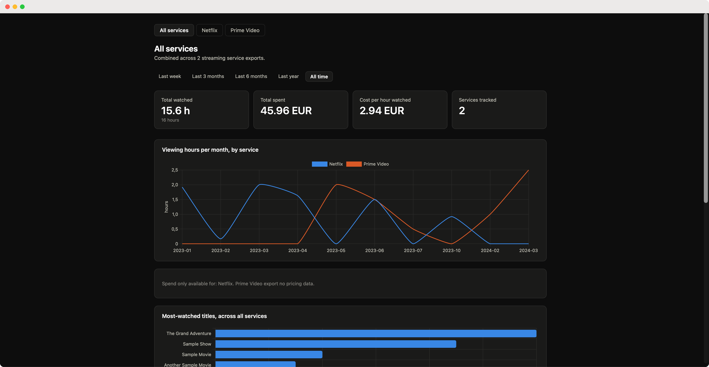

#  streamstats



A local dashboard for your streaming history: hours watched, money spent, and more. It runs entirely on your machine using the official data exports from Netflix and Prime Video (more services coming soon).

## Quickstart

```bash
python3 -m venv venv
./venv/bin/pip install -r requirements.txt
./venv/bin/python app.py
```

Open http://127.0.0.1:8001. Without your own data, it uses `sample_data/`.

## Using your own data

1. Request your export from your wanted service (look at `streaming_services.md` for instructions)
2. Unzip it into `raw_data/netflix/` or `raw_data/primevideo/`, keeping the original folder structure.
3. Restart the app.

## Features

- Hours watched and spend per month, cost per hour, top shows, and a searchable history table
- Per-service pages (`/netflix`, `/primevideo`) and a combined view (`/`)
- Time-range filter from last week to all time
- Your watch time converted into other activities

Note: Prime Video has no spend data, since Amazon bills Prime at the account level.

## Development

Each service implements a shared `StreamingService` interface (`streaming/base.py`), so adding a new one doesn't touch the analytics or templates. See [ARCHITECTURE.md](ARCHITECTURE.md).

Tests run against `sample_data/`:

```bash
./venv/bin/python tests/test_netflix.py
./venv/bin/python tests/test_primevideo.py
```

## Contribution
Contributions and new services are welcome :)

## License

MIT, see [LICENSE](LICENSE).
